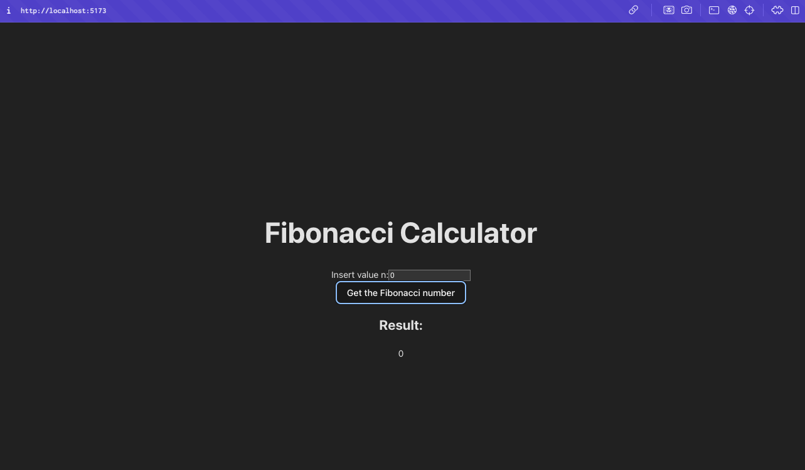
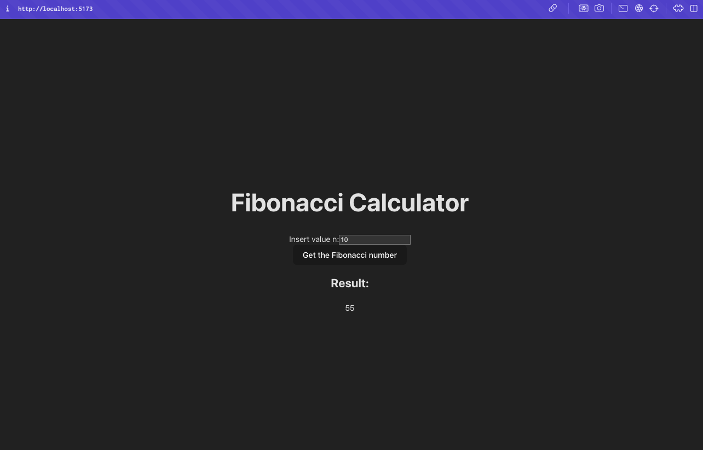
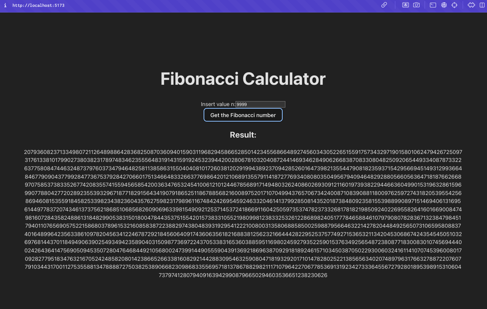
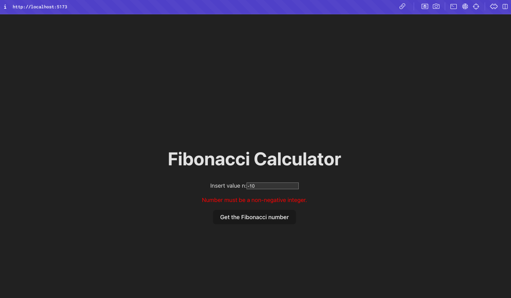
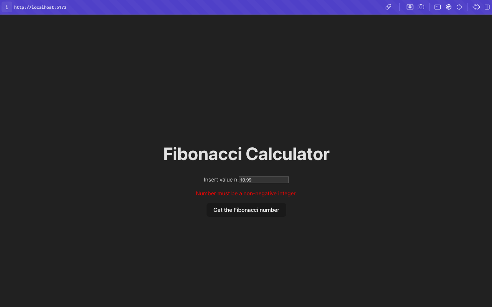
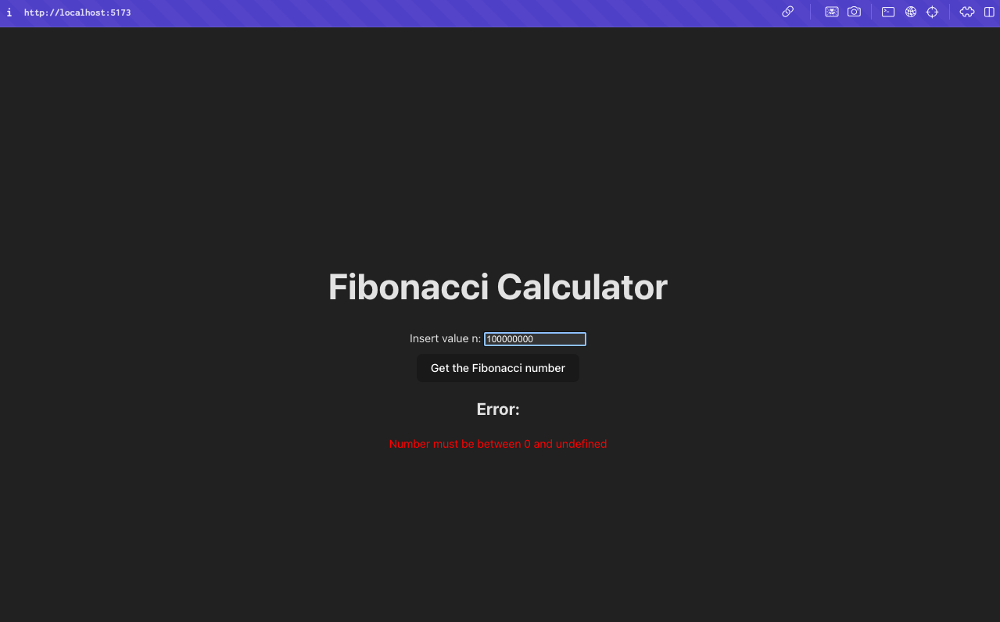

# Fibonacci Application

## Application Description

This application is a web-based tool for calculating Fibonacci numbers based on user input. It consists of a backend that provides an API for computing Fibonacci numbers and a frontend that allows users to input a value `n` and display the result.

## Functionality

- **Backend:**
  - Built with Node.js, Fastify, and TypeScript.
  - Provides a REST API endpoint `/fibonacci/:n` that returns the n-th Fibonacci number.
  - Implements input validation using Zod.
  - Uses `BigInt` to handle large numbers.
  - Implements caching with `LRUCache` to improve performance.
  - Includes security features like CORS, Helmet, and Rate Limiter.
- **Frontend:**
  - Built with React and TypeScript.
  - Allows users to input the value `n` via a form.
  - Performs client-side input validation using Zod and React Hook Form.
  - Communicates with the backend API using Axios.
  - Displays the result or error messages to the user.

## Example of the app

### Fibonacci Calculator n=0



### Fibonacci Calculator n=10



### Fibonacci Calculator n=9999



### Fibonacci Calculator n is negative number



### Fibonacci Calculator n is not an integer



### Fibonacci Calculator n is too large



## How to Run the Application

### Prerequisites

- Node.js
- NPM

### Backend

1. **Clone the Repository**

   If you haven’t already, clone the repository:

   ```bash
   git clone <repo-url>
   cd fibonacci-number/backend
   ```

2. **Install Dependencies**

   In the backend directory, run:

   ```bash
   npm install
   ```

3. **Create a .env File**

   Create a `.env` file in the backend directory and add the following content:

   ```env
   PORT=3000
   MAX_NUMBER=100000
   FRONTEND_HOST=http://localhost:5173
   ```

4. **Start the Backend Server**

   - For development mode with automatic restarts on changes:

     ```bash
     npm run dev
     ```

5. **Test the API**

   Open a browser or use a tool like `curl` or Postman to send a request:

   ```bash
   GET http://localhost:3000/fibonacci/10
   ```

   Expected response:

   ```json
   {
     "result": "55"
   }
   ```

### Frontend

1. **Navigate to the Frontend Directory**

   ```bash
   cd ../frontend
   ```

2. **Install Dependencies**

   In the frontend directory, run:

   ```bash
   npm install
   ```

3. **Create a .env File**

   Create a `.env` file in the frontend directory and add the following content:

   ```env
   VITE_API_BASE_URL = 'http://localhost:3000'
   ```

4. **Start the Frontend Server**

   Start the development server:

   ```bash
   npm run dev
   ```

   The application will be available at [http://localhost:5173](http://localhost:5173).

5. **Use the Application**

   - Open [http://localhost:5173](http://localhost:5173) in your browser.
   - Enter a value for `n` in the form.
   - Click the "Calculate Fibonacci Number" button.
   - The result or an error message will be displayed below the form.

## Important Notes

- **CORS:** The backend is configured to allow CORS requests from the frontend running at [http://localhost:5173](http://localhost:5173). If you are using a different port or domain, adjust the CORS settings in `backend/src/plugins/cors.ts`.
- **Validation:** The application performs input validation on both the client and server sides using Zod, ensuring that only valid `n` values are processed.
- **Large Numbers:** The application uses `BigInt` to handle large Fibonacci numbers. For very large values of `n`, the computation may take some time.
- **Limitations:** To ensure performance and stability, the maximum allowed value for `n` is set to based the .env variable `MAX_NUMBER=100000`. If you enter a higher value, the application will return an error message.

## Project Structure

- `backend/`: Contains the source code for the backend application.
- `frontend/`: Contains the source code for the frontend application.
